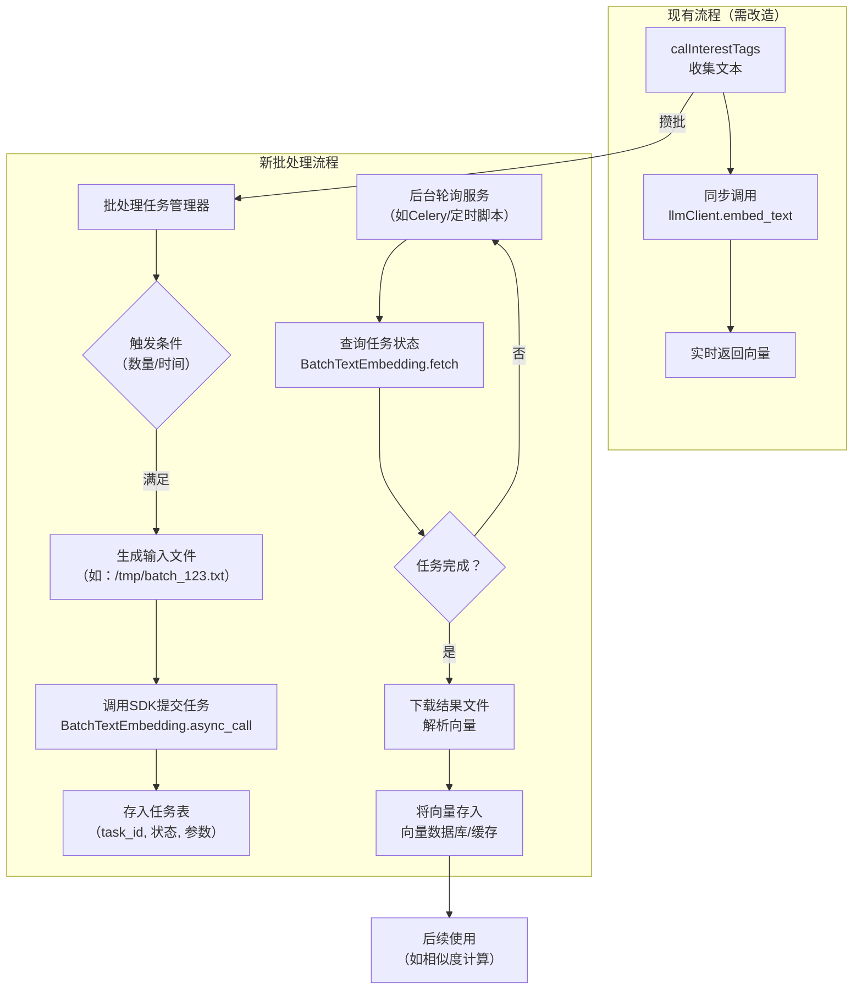

# 1 批处理向量化

> 问题：阿里云官方也提供了批处理接口（https://bailian.console.aliyun.com/cn-beijing/?spm=5176.29597918.J_SEsSjsNv72yRuRFS2VknO.2.5d00133ckc2ZO5&tab=api#/api/?type=model&url=2712516）。
> 如果使用官方接口，现有代码该如何改动？

要使用阿里云的官方批处理接口，你不需要完全推翻现有代码，而是可以将当前的同步调用方式重构为**异步批处理任务**。这样可以充分利用其处理海量文本的能力，并避开限流。

### 📝 核心改动思路

现有代码（`llmClient.py`）是**同步、逐条**调用，而官方批处理接口是**异步、文件级**的。因此，改造的核心在于：

1.  **将“逐条请求”变为“攒批文件”**：`interestTag.py`不再直接调用`embed_text`，而是把需要向量化的文本先收集起来。
2.  **将“实时调用”变为“异步任务”**：攒到一定量后，生成一个文本文件，通过SDK或HTTP接口提交一个批处理任务，获取一个`task_id`。
3.  **将“同步等待”变为“轮询结果”**：用一个后台服务（如定时任务）根据`task_id`轮询任务状态，任务完成后下载结果文件，解析后供后续使用。

### 🏗️ 推荐架构调整

你需要新增一个**批处理任务管理器**，并修改现有的调用流程。



### 🛠️ 关键代码示例（以Python DashScope SDK为例）

以下是在你的`llmClient.py`基础上，新增批处理功能的核心代码片段。

#### 1. **在`llmClient.py`中新增批处理函数**

```python
# src/util/llmClient.py
import time
import os
from dashscope import BatchTextEmbedding  # 需安装：pip install dashscope

class BailianEmbeddingClient:
    # ... 原有的 __init__ 等方法保持不变 ...

    def submit_batch_task(self, texts: List[str], text_type: str = "document") -> str:
        """
        提交一个批处理任务
        Args:
            texts: 需要向量化的文本列表
            text_type: 'query' 或 'document'
        Returns:
            task_id: 任务ID，用于后续查询
        """
        # 1. 将文本列表写入临时文件（一行一条）
        import tempfile
        with tempfile.NamedTemporaryFile(mode='w', suffix='.txt', encoding='utf-8', delete=False) as f:
            for t in texts:
                f.write(t + '\n')
            temp_file_path = f.name

        # 2. （可选）将文件上传到OSS或可访问的HTTP服务器，获取一个公网URL
        #    这里简化处理，假设你有一个文件托管服务
        file_url = self.upload_to_temp_storage(temp_file_path) 
        
        # 3. 使用DashScope SDK提交异步任务
        #    注意：这里使用的是 dashscope SDK，不是之前的 openai 客户端
        response = BatchTextEmbedding.async_call(
            model=BatchTextEmbedding.Models.text_embedding_async_v2, # 或 v1
            url=file_url,
            text_type=text_type
        )
        
        if response.status_code == 200:
            task_id = response.output['task_id']
            print(f"✅ 批处理任务提交成功，task_id: {task_id}")
            return task_id
        else:
            print(f"❌ 批处理任务提交失败: {response.message}")
            return None

    def get_task_result(self, task_id: str, wait: bool = True):
        """
        查询或等待批处理任务结果
        Args:
            task_id: 任务ID
            wait: 是否等待任务完成（阻塞）
        Returns:
            解析后的向量列表，顺序与输入文本一致
        """
        if wait:
            # 同步等待任务结束（内部封装了轮询逻辑）
            response = BatchTextEmbedding.wait(task_id)
        else:
            # 仅查询一次状态
            response = BatchTextEmbedding.fetch(task_id)
        
        if response.status_code == 200 and response.output.task_status == 'SUCCEEDED':
            result_url = response.output.url
            # 下载并解析结果文件（.gz压缩的jsonl）
            vectors = self.parse_result_file(result_url)
            return vectors
        else:
            print(f"❌ 任务失败或状态异常: {response}")
            return None

    def upload_to_temp_storage(self, file_path):
        """（示例）将文件上传到临时存储并返回URL"""
        # 重要: 官方接口要求输入是一个可访问的 HTTP URL
        # 你需要实现上传到 OSS 或你自己的文件服务器的逻辑
        # 如果只是测试，可以使用一些临时文件分享服务，但不推荐用于生产
        # 这里假设你有一个上传函数
        # url = upload_to_oss(file_path)
        # return url
        raise NotImplementedError("需要实现文件上传逻辑以获取公网URL")
```

#### 2. **在`interestTag.py`中修改调用逻辑**

修改`calInterestTags`函数，不再实时调用，而是将文本“攒”起来。

```python
# src/algorithm/interestTag.py
# ... 导入部分，新增一个队列或缓存 ...

# 一个简单的全局缓存，用于攒批（生产环境请使用Redis等）
_batch_text_cache = []
_batch_cache_lock = threading.Lock()

def add_to_batch(text: str, metadata: dict):
    """将需要向量化的文本加入批处理队列"""
    with _batch_cache_lock:
        _batch_text_cache.append((text, metadata))
        # 当积累到一定数量（如500条）或定时触发时，提交任务
        if len(_batch_text_cache) >= 500:
            texts_to_process = [item[0] for item in _batch_text_cache]
            metas_to_process = [item[1] for item in _batch_text_cache]
            _batch_text_cache.clear()
            # 异步提交批处理任务（不阻塞当前计算）
            threading.Thread(target=submit_and_process_batch, args=(texts_to_process, metas_to_process)).start()

def submit_and_process_batch(texts, metadatas):
    """提交批处理任务，并在完成后处理结果"""
    client = get_embedding_client()
    task_id = client.submit_batch_task(texts, text_type="query") # 这里假设是query类型
    
    if task_id:
        # 存储 task_id 与元数据的映射，供后续回调使用
        # 例如存入Redis: {task_id: {'texts': texts, 'metadatas': metadatas}}
        store_task_mapping(task_id, texts, metadatas)
        # 可以启动一个后台协程或依赖轮询服务来获取结果
    else:
        # 提交失败，降级处理（例如调用旧版matchText）
        for metadata in metadatas:
            # ... 降级逻辑 ...
            pass
```

#### 3. **创建一个独立的后台服务用于轮询任务结果**

可以创建一个新的Python脚本（如`batch_result_poller.py`），作为常驻服务或定时任务运行：

```python
# batch_result_poller.py
import time
from src.util.llmClient import get_embedding_client
from your_redis_client import get_redis_client # 假设你用Redis存储映射

def poll_for_results():
    client = get_embedding_client()
    redis_client = get_redis_client()
    
    while True:
        # 从Redis获取所有进行中的task_id
        for task_id in redis_client.smembers('processing_tasks'):
            result = client.get_task_result(task_id, wait=False)
            if result: # 任务已完成
                # 1. 从Redis获取对应的元数据
                texts, metadatas = get_task_mapping(task_id) 
                # 2. 将向量结果（result）与元数据结合，进行后续处理
                #    例如，计算相似度、更新用户画像等
                process_vectors(result, texts, metadatas)
                # 3. 清理任务记录
                redis_client.srem('processing_tasks', task_id)
                delete_task_mapping(task_id)
        time.sleep(60) # 每分钟轮询一次

if __name__ == "__main__":
    poll_for_results()
```

### ⚠️ 重要注意事项

1.  **文件存储与URL**：官方接口的输入是一个**可公网访问的HTTP文件URL**。你需要一个中间存储（如阿里云OSS）来上传并生成这些文件的临时链接。这是改造中技术复杂度最高的部分。
2.  **异步带来的复杂性**：你的核心算法`calInterestTags`将从同步计算变为“提交任务-稍后获取结果”的模式。这需要你重新设计数据流向，可能引入消息队列或任务表来管理状态。
3.  **成本与时机**：批处理适合非实时、可以等待的场景。对于用户画像这种通常可以接受一定延迟（如分钟级）的计算，是合适的。但如果你有需要实时响应的场景，仍需保留同步的降级方案。
4.  **模型选择**：根据你的需求选择`text-embedding-async-v2`（1536维）或`v1`。维度越高，精度可能越高，但存储和计算成本也越大。你的`vectorization.py`中的ES索引维度需要与此匹配。
5.  **限流与并发**：官方文档提到并发任务数限制（例如同时处理中任务不超过3个）。你的任务管理器需要实现排队和流量控制。

总的来说，这个改造能从根本上解决单条请求的效率问题，但会显著增加系统的异步处理复杂度。你需要权衡开发成本和性能收益，并仔细设计任务的生命周期管理。

如果你需要针对其中某个环节（比如如何与现有的`vectorization.py`整合结果）进行更详细的讨论，我可以提供进一步的思路。

# 2 计算文本独特性

> 我们的算法漏了一部分没实现，即计算文本独特性。在若干句弹幕中，如何计算某一句弹幕在这堆弹幕中的独特性？请提供一个你认为的适合快速嵌入毕业论文的算法方案

这是一个非常关键的问题。你之前的 `danmuScore.py` 中预留了 `uniqueness = 1.0 / (video_context.count_similar(clean_text) + 1)` 的计算位置，但没有实现核心的相似度判断。

针对**毕业论文场景**，你需要的是一个**原理清晰、效果可解释、实现简单且计算高效**的方案。这里推荐使用 **TF-IDF + 余弦相似度** 的方法，这是信息检索领域最经典的文本相似度算法，用于计算文本独特性非常合适。

---

## 一、算法原理

在数学上，一段文本 $d$ 在文档集合 $D$（即当前视频的所有弹幕）中的**独特性**可以定义为：

\[
Uniqueness(d, D) = 1 - \max_{d' \in D, d' \neq d} Sim(d, d')
\]

其中 $Sim(d, d')$ 是两条弹幕之间的文本相似度。相似度越高，独特性越低；相似度越低，独特性越高。

为了避免除以零，可以进一步修正为：

\[
Score_{uniqueness}(d) = \frac{1}{\max_{d' \in D, d' \neq d} Sim(d, d') + \epsilon}
\]

其中 $\epsilon$ 是一个极小正数（如 0.01），用于防止分母为零。

---

## 二、相似度计算方法

采用 **TF-IDF 向量 + 余弦相似度** 计算两条弹幕之间的相似度。

### 2.1 TF-IDF 向量化

对于弹幕文本 $d$，将其表示为 TF-IDF 向量 $\mathbf{v}_d$：

- **TF（词频）**：词在弹幕中出现的次数
- **IDF（逆文档频率）**：$\log\frac{N}{n_t}$，其中 $N$ 为总弹幕数，$n_t$ 为包含词 $t$ 的弹幕数

### 2.2 余弦相似度

\[
Sim(d_i, d_j) = \frac{\mathbf{v}_{d_i} \cdot \mathbf{v}_{d_j}}{\|\mathbf{v}_{d_i}\| \|\mathbf{v}_{d_j}\|}
\]

相似度取值范围为 $[0, 1]$，值越大表示两条弹幕越相似。

---

## 三、论文中的算法描述

在论文中，你可以这样表述：

> **“文本独特性计算采用基于TF-IDF与余弦相似度的最大相似度判别法。具体步骤如下：**
>
> **步骤1**：对当前视频的所有弹幕进行分词与停用词过滤，得到词项集合。
>
> **步骤2**：计算每个词项的TF-IDF权重，将每条弹幕转换为高维向量表示。
>
> **步骤3**：对于待评估弹幕 $d$，计算它与视频中其他所有弹幕的余弦相似度，取其中的最大值作为其最大相似度 $\theta_{max}(d)$。
>
> **步骤4**：定义独特性得分为 $U(d) = \frac{1}{\theta_{max}(d) + \epsilon}$，其中 $\epsilon$ 为平滑参数，取 $10^{-6}$。该得分与最大相似度呈反比关系：弹幕与任何其他弹幕均不相似时，得分趋近于1；存在高度相似弹幕时，得分趋近于0。
>
> **该方法的优势在于**：TF-IDF能够有效区分高频通用词与低频特征词，余弦相似度能够衡量文本间的语义方向一致性，两者结合能客观反映弹幕在语料中的稀缺程度，且计算复杂度为 $O(n^2)$，在弹幕规模可控范围内具有良好的工程可行性。”

---

## 四、代码实现（可直接嵌入你的项目）

在 `danmuScore.py` 中添加以下函数：

```python
from sklearn.feature_extraction.text import TfidfVectorizer
from sklearn.metrics.pairwise import cosine_similarity
import numpy as np

def calculate_uniqueness_scores(danmaku_texts: list) -> list:
    """
    计算一批弹幕中每一条的独特性分数
    
    Args:
        danmaku_texts: 弹幕文本列表，每条文本已经过预处理（分词、去停用词）
    
    Returns:
        uniqueness_scores: 每条弹幕的独特性得分列表，取值范围 (0, 1]
    """
    if len(danmaku_texts) <= 1:
        # 单条弹幕或没有弹幕时，独特性设为最大值
        return [1.0] * len(danmaku_texts) if danmaku_texts else []
    
    # 1. 使用 TF-IDF 将文本转换为向量
    vectorizer = TfidfVectorizer()
    tfidf_matrix = vectorizer.fit_transform(danmaku_texts)
    
    # 2. 计算所有弹幕两两之间的余弦相似度矩阵
    similarity_matrix = cosine_similarity(tfidf_matrix)
    
    # 3. 对于每条弹幕，取与其他弹幕的最大相似度（排除自身，即对角线）
    np.fill_diagonal(similarity_matrix, 0)  # 将自身相似度设为0
    max_similarities = np.max(similarity_matrix, axis=1)
    
    # 4. 计算独特性得分
    epsilon = 1e-6
    uniqueness_scores = 1.0 / (max_similarities + epsilon)
    
    # 可选：归一化到 [0, 1] 区间（将最大值映射为1）
    max_score = np.max(uniqueness_scores)
    if max_score > 0:
        uniqueness_scores = uniqueness_scores / max_score
    
    return uniqueness_scores.tolist()
```

### 在 `calDanmuScore` 中集成

修改原有的独特性计算逻辑，改为调用批量计算函数：

```python
def calDanmuScore(danmaku, sender_profile, video_context):
    # ... 原有代码 ...
    
    # 获取当前视频所有弹幕的文本列表（需要在 video_context 中提供）
    all_texts = video_context.get_all_cleaned_texts()
    
    # 计算所有弹幕的独特性得分（建议在视频级别缓存结果，避免重复计算）
    uniqueness_scores = video_context.get_uniqueness_scores()
    
    # 当前弹幕的独特性得分
    uniqueness = uniqueness_scores[video_context.current_index]
    
    # ... 后续加权计算 ...
```

---

## 五、工程优化建议（论文可提及）

| 优化点       | 说明                                                         |
| ------------ | ------------------------------------------------------------ |
| **缓存机制** | 同一视频的弹幕语料不变时，TF-IDF矩阵和相似度计算结果可缓存，避免重复计算 |
| **分块计算** | 弹幕数量过大时（如 > 5000），可采用滑动窗口或随机采样，降低计算复杂度 |
| **增量更新** | 新弹幕加入时，可使用近似算法（如局部敏感哈希LSH）快速估计相似度 |

---

## 六、论文中的公式表达

如果你希望使用更学术化的公式，可以这样写：

设当前视频共有 $n$ 条弹幕，其文本集合为 $\mathcal{D} = \{d_1, d_2, \ldots, d_n\}$。对于弹幕 $d_i$，其TF-IDF向量表示为 $\mathbf{v}_i$。定义弹幕 $d_i$ 与其他所有弹幕的最大余弦相似度为：

\[
\theta_{max}(d_i) = \max_{j \neq i} \frac{\mathbf{v}_i \cdot \mathbf{v}_j}{\|\mathbf{v}_i\| \|\mathbf{v}_j\|}
\]

则弹幕 $d_i$ 的独特性得分 $U(d_i)$ 定义为：

\[
U(d_i) = \frac{1}{\theta_{max}(d_i) + \varepsilon}
\]

其中 $\varepsilon = 10^{-6}$ 为平滑参数。该得分与弹幕在语料中的语义稀缺程度成正比：当 $d_i$ 与任何其他弹幕均不相似时，$\theta_{max}(d_i) \approx 0$，$U(d_i) \approx 1$；当存在高度相似的弹幕时，$\theta_{max}(d_i)$ 趋近于1，$U(d_i)$ 趋近于0.5。

> 如何通俗易懂地理解 @uniqueness.py 中计算文本独特性的算法？我看不太懂

这个算法的核心思想其实非常直观，我用人话解释一下：

---

## 一句话概括

**一条弹幕越"不像"其他弹幕，它就越独特。**

---

## 分步讲解（用比喻）

### 第 1 步：把文字变成数字向量

> 就像老师给作文打分，先要把"内容"量化为"分数"。

TF-IDF 做的事：统计每条弹幕中每个词的重要性。
- 如果某个词在这条弹幕中出现得多，但在所有弹幕中很少见 → 这个词权重高。
- 比如 100 条弹幕里，"哈哈哈"到处都是 → 权重低；"量子力学"只出现一次 → 权重极高。

最终每条弹幕变成一串数字（向量），比如：
```
弹幕A: [0.1, 0.8, 0.0, 0.3, ...]
弹幕B: [0.1, 0.7, 0.0, 0.2, ...]
弹幕C: [0.0, 0.0, 0.9, 0.0, ...]
```

---

### 第 2 步：算两两相似度

> 就像比较两份答卷，看它们答案有多接近。

用**余弦相似度**算出每两条弹幕的相似程度，结果是一个数（0 = 完全不搭边，1 = 一模一样）：

```
         弹幕A   弹幕B   弹幕C
弹幕A    1.00    0.95    0.10    ← A和B几乎一样，和C完全不同
弹幕B    0.95    1.00    0.12
弹幕C    0.10    0.12    1.00
```

---

### 第 3 步：找到"最像你的那条弹幕"

> 不看自己和自己的比较（永远是1.00），看别人里谁最像我。

先把对角线（自己和自己比）**清零**，然后每行取最大值：

```
         弹幕A   弹幕B   弹幕C    |  最像的别人
弹幕A    0       0.95    0.10    |  0.95  (B最像A)
弹幕B    0.95    0       0.12    |  0.95  (A最像B)
弹幕C    0.10    0.12    0       |  0.12  (B最像C)
```

---

### 第 4 步：相似度越高 → 独特性越低

> 你越和别人雷同，你就越不独特。

公式：**独特性 = 1 / (最像你的相似度 + 极小值)**

| 弹幕 | 最相似度 | 独特性（反转后）  | 含义           |
| ---- | -------- | ----------------- | -------------- |
| A    | 0.95     | 1/0.95 ≈ **1.05** | 很雷同，不独特 |
| C    | 0.12     | 1/0.12 ≈ **8.33** | 独树一帜！     |

加 `ε = 0.000001` 只是为了防止除以 0（万一有弹幕和别人完全不像，相似度为 0）。

---

### 第 5 步：归一化到 [0, 1]

> 把所有人的分数统一缩放到 0~1 之间，方便比较。

所有分数除以最高分：
```
C: 8.33 / 8.33 = 1.00   ← 最独特
A: 1.05 / 8.33 ≈ 0.13   ← 最不独特
```

---

## 一句话总结流程图

```
弹幕文本 → TF-IDF向量 → 两两相似度 → 找出最像的那条 → 
反转（越像越不独特）→ 归一化 → 0~1 的独特性分数
```

**核心就一句话：如果全世界都和你很像，那你就不独特；如果全世界没人和你像，那你就独一无二。** 🎯

> 第四步只和最相似那一条比对，其余全部忽略，这种做法有何缺陷？

这是个很好的问题。**"只看最相似的那一条"** 这种做法确实有几个明显的缺陷：

---

## 缺陷 1：信息丢失严重

假设有 100 条弹幕，我们对比如下两种场景：

```
场景A（弹幕X）：
  - 和弹幕Y 相似度 0.95  ← 只取这个最大值
  - 其余 98 条相似度都在 0.05 以下
  ⇒ max = 0.95，得分 ≈ 0.13（"不独特"）

场景B（弹幕Z）：
  - 和弹幕W 相似度 0.95  ← 同样的最大值
  - 其余 98 条相似度全在 0.85 以上
  ⇒ max = 0.95，得分 ≈ 0.13（"不独特"）
```

**两者得分完全一样，但直觉上：**
- 弹幕 X 只是碰巧和某一条凑巧相似，整体上其实是独树一帜的
- 弹幕 Z 是老生常谈的"刷屏弹幕"，几乎所有弹幕都说差不多的话

**用 max 无法区分这两种情况。**

---

## 缺陷 2：对噪声/重复内容过度敏感

只要出现一条近乎重复的弹幕，独特性直接崩盘：

```
弹幕D："今天天气真好，适合出门散步晒太阳"
弹幕E："今天天气真好，适合出门散步晒太阳" （复制粘贴）

弹幕D 的 max = 0.99 → 独特性 → 0
```

即使其余 999 条弹幕和 D 毫不相干，就因为有一个"复读机"，D 的独特性就被判定为极低。**一个近邻毁所有。**

---

## 缺陷 3：无法区分"孤岛"和"大陆"

```
          ●      ●
         孤岛   孤岛

    ●●●●●●●●●●●●●●
      大陆（刷屏集群）
```

用 max 来衡量：
- 孤岛上的人：max 很小 → 高独特性 ✓
- 大陆边缘的人：max 很大 → 低独特性 ✓
- **大陆中心的人**：max 也很大 → 低独特性 ✓

这看起来没问题，但如果大陆上每个人和最近邻居的 max 都是 0.9，那所有人都一样"不独特"，**集群内部的差异性完全被洗掉了**。一条略有新意的弹幕和一条完全复读的弹幕，可能得到同样的分数。

---

## 缺陷 4：一维数值的天然局限

把整条"相似度分布曲线"压缩成一个标量（max），等于用**一个点概括一条线**，必然损失大量信息。

---

## 可能的改进方向

| 方案                 | 思路                                        | 适用场景                  |
| -------------------- | ------------------------------------------- | ------------------------- |
| **取 Top-K 平均值**  | 取最相似的 K 条求平均，降低单条噪声影响     | K 较小（3~5），保留敏感度 |
| **取整体平均相似度** | 用它对所有弹幕的平均相似度来衡量            | 反映"在大众眼中的独特性"  |
| **密度聚类法**       | 用 DBSCAN 等找到簇，簇越大 → 成员独特性越低 | 刷屏弹幕检测              |
| **分位数法**         | 取第 90 百分位相似度，而非最大值            | 消除极值噪声              |
| **加权组合**         | max × 0.3 + mean × 0.7，结合极端值和整体    | 平衡                      |

---

## 总结

> **"只和最像的人比"** → 相当于在 100 人的班级里，只因为你有一个人和你长得像，就说你"不够独特"。这显然是不够公允的。

这种设计在**刷屏弹幕检测**等简单场景下够用（发现复读机），但如果想更精细地衡量"文本内容的相对独特性"，确实需要用更多统计量来刻画相似度分布的全貌。
